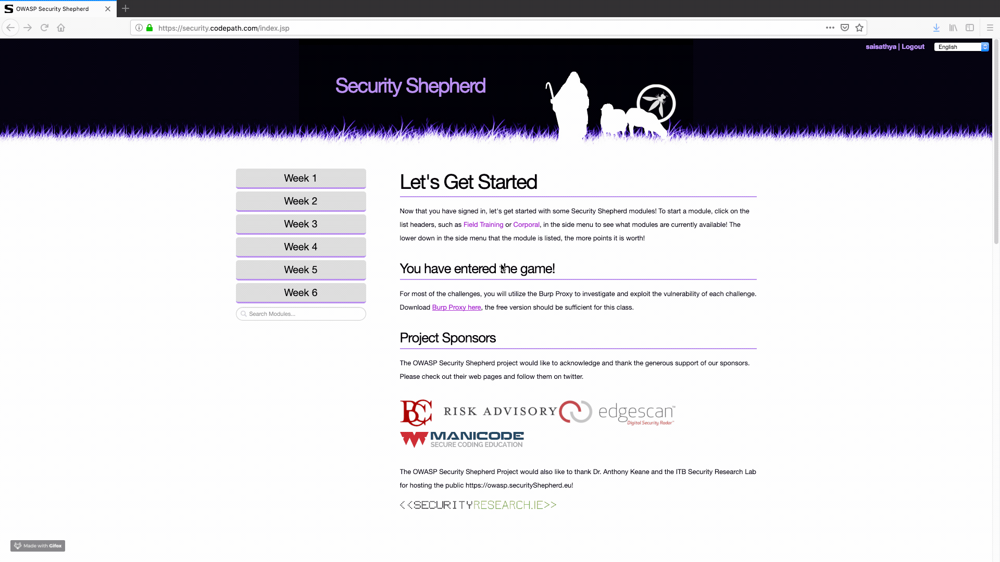

# CodePath Cybersecurity Week 1 - Sai Sathya

Time spent: **2.5** hours spent in total 

## User Stories
1. Set up Burp
2. Challenge 1 - HTTP Headers
3. Challenge 2 - HTTP Methods
4. Challenge 3 - Basic Routes 1 
5. Challenge 4 - Query Params 1
6. Challenge 5 - IDOR
7. Challenge 6 - IDOR 1
8. Challenge 7 - IDOR 2  (Bonus) (INCOMPLETE)
9. Challenge 8 - IDOR Bank (Bonus)

## Video Walkthrough

## Notes
Struggled and didn't manage to finish Challenge 7
